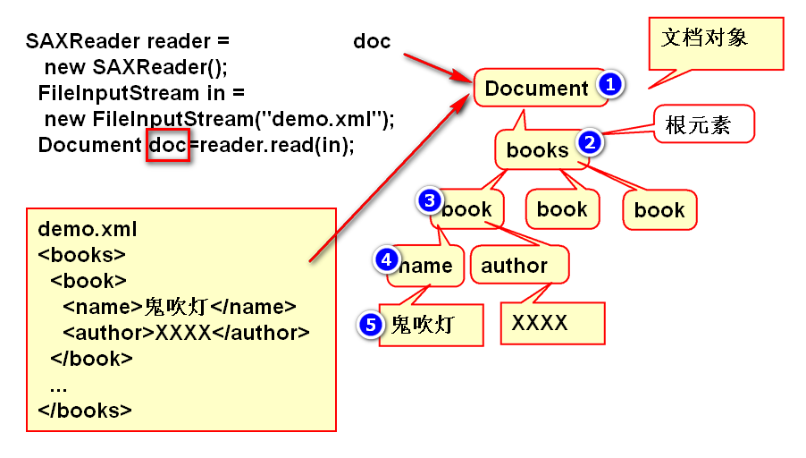

# XML

## 处理指令

语法：

	<?xml version="1.0" encoding="UTF-8"?>

1. 必须在第一行
2. 属性之间有空格
3. version="1.0" 只能是1.0
4. encoding="UTF-8" 建议使用 UTF-8

## 注释

语法：

	<!-- 第一个XML -->

1. 不能嵌套使用
2. 不能够使用Java 注释
3. 可以在任意位置使用

## 标签(标记、tag)

标签语法
	
	<标签名>
	<books> 开始标签
	</books> 结束标签
	<author/> 单标签 等价于<author></author> 
		

1. 标签名任意

## 元素（element）

元素
	
	<标签>内容</标签> 的整体称为元素

元素的内容：
1. 文本
2. 元素
3. 文本+元素混合

> 子元素：元素中的元素，称为子元素
	
	<books>
		<book>
			<name>鬼吹灯</name>
		</book>
	</books>

	
## 属性

1. 属性名可以扩展
2. 属性值必须使用引号
3. 属性之间有空格
4. 属性名不能重复
5. 属性没有顺序

	<book id="b1" lang="中文" >
	</book>

## 格式良好 XML

1. 大小写敏感(区别大小写)
2. 有唯一的根元素
3. 标签必须成对使用
	- 有开始标签一定有结束标签
	- 空标签可以替换为单标签  
4. 标签不能交叉嵌套
5. 属性必须在开始标签上定义
6. 属性值必须使用 引号 
7. 属性不能重复

## XML的可扩展性

1. 标签名（元素名）可以任意扩展
2. 元素的嵌套关系可以任意的扩展
3. 属性可以任意扩展

## 实体

对于 > < & 等特殊符号，不能直接写到XML的文本中，需要替换为 **实体**

常见实体（必须记住）：

	> &gt;
	< &lt;
	& &amp;

案例：

	<name>小于号 &lt; 大于号 &gt; 的用法 </name>

## CDATA 段

可以在CDATA中使用特殊符号， 不需要替换为 **实体** 

案例代码：

	<abstract>
		<![CDATA[
			< 小于号 > 大于号 的用法
			<hello>
		]]>
	</abstract>

## maven 在线搜索

	http://maven.tedu.cn/nexus/
	http://maven.aliyun.com/nexus/

## maven 配置片段

校内：
	
	<mirrors>
		<mirror>
			<id>nexus</id>
			<name>Tedu Maven</name>
			<mirrorOf>*</mirrorOf>
			<url>http://maven.tedu.cn/nexus/content/groups/public</url>
		</mirror>
	</mirrors>

公网：

	<mirrors>
		<mirror>
			<id>nexus</id>
			<name>Tedu Maven</name>
			<mirrorOf>*</mirrorOf>
			<url>http://maven.aliyun.com/nexus/content/groups/public</url>
		</mirror>
	</mirrors>

## dom4j API

1. Java解析读写XML的API
2. 底层封装了 W3c DOM API
3. dom4j API 使用便捷简单

### 使用maven 导入Dom4j API

修改 Maven项目的pom.xml 文件添加 dom4j，保存时候就自动下载了 dom4j 的jar文件

> 如果maven 配置有问题，就不能正确下载jar

代码:

	<dependency>
	  <groupId>dom4j</groupId>
	  <artifactId>dom4j</artifactId>
	  <version>1.6.1</version>
	</dependency> 

### dom4j 读取XML文件

> SAXReader 是 dom4j 提供的高级流，必须依赖低级流！

代码：

	SAXReader reader = new SAXReader();
	FileInputStream in =
		new FileInputStream("demo.xml");
	//读取XML文件到doc对象
	Document doc=reader.read(in);
	//doc 是全部的XML文件的内容
	//doc 引用的是内存中的对象。
	System.out.println(doc.asXML()); 

### Document（DOM）对象结构

xml文件读取到内存的DOM对象，其结构是xml文件的数据结构一致：

### Document API

Document 对象是一棵文档树的根，可为我们提供对文档数据的最初（或最顶层）的访问入口。

Element getRootElement()用于获取根元素。

语法：

	//获取XML的根元素
	//访问XML中数据的唯一入口。
	Element root = doc.getRootElement();

### Element API

每个XML文件中的元素都映射到DOM对象中的一个Element对象。

Element对象提供了对其内容的访问方法。

API	
	
	//用名字查找返回第一个满足条件的子元素
	Element e = root.element("book");
	System.out.println(e.asXML());
	
	//返回当前元素的全部子元素
	List<Element> list=root.elements();
	for(Element e:list){
		System.out.println(e.asXML()); 
	}

### Element .element() 方法

用名字查找子元素，返回第一个满足条件的子元素

用法：

	//用名字查找返回第一个满足条件的子元素
	Element e = root.element("book");
	System.out.println(e.asXML());

### Element.elements() 方法

返回当前元素的全部子元素。返回结果是一个List集合，集合中每个元素都是Element类型的对象。

> 提示：利用迭代器遍历这个集合，就是遍历每个xml子元素。使用List提供的get(index)方法按照序号获取某个位置的子元素。

用法：

	//返回当前元素的全部子元素
	List<Element> list=root.elements();
	for(Element e:list){
		System.out.println(e.asXML()); 
	}	
	//获取第二个子元素
	Element e = list.get(1);

### Element.getName() 方法

获取当前元素的名字方法，返回元素的名字，元素的名字就是元素的标签名称。

用法：

	Element e = root.element("book");
	String name = e.getName();
	System.out.println(name);

### Element.getText() 方法

获取当前元素的文本内容，只能在有文本内容的元素上调用这个方法，返回这个元素的文本内容。

> 有个更加方便的方法 getTextTrim() 可以去除返回结果两端的空白。

用法：

	Element e = root.element("book");
	Element n = e.element("name");
	String text = n.getText(); 
	String text2 = n.getTextTrim(); 
	System.out.println(text);
	System.out.println(text2);

### Element.attribute() 方法

返回一个元素的属性，参数是属性的名称，返回Attribute对象

Attribute对象包含常用方法：
- getName() 返回属性名
- getValue() 返回属性值
- setValue() 修改属性值

用法：
	
	Element e = root.element("book");
	Attribute attr = e.attribute("id");
	System.out.println(attr.asXML());
	System.out.println(attr.getName());
	System.out.println(attr.getValue()); 

### XMLWriter 类

用于将XML对象doc 写到文件中。

> XMLWriter 是高级流，必须依赖低级的byte流，可以添加漂亮的打印格式，输出的文件会格式化的漂亮很多。

> 注意：流使用以后请务必关闭！

用法：

	//写XML Document 对象 到文件中
	FileOutputStream out = 
		new FileOutputStream("ok.xml");
	//dom4j 提供了格式工具，可以输出时候
	//对doc进行化妆，搞漂亮（Pretty）一些
	OutputFormat fmt = 
		OutputFormat.createPrettyPrint();
	//XMLWriter 是dom4j 提供的高级流，
	//需要依赖低级的字节流。
	XMLWriter writer = 
		new XMLWriter(out, fmt);
	//将doc对象（XML）写到流中
	writer.write(doc);
	writer.close();

### 向XML元素中添加内容

- Element.addElement(元素名) 向当前元素中添加新的子元素。
- Element.setText(文本内容) 更改当前元素的文本内容
- Element.addAttribute(属性名, 属性值) 设置当前元素的属性

用法：

	Element newOne=root.addElement("book");
	newOne.addElement("name")
		.setText("18岁给我一个姑娘");
	newOne.addElement("author")
		.setText("冯唐"); 
	newOne.addAttribute("id", "b5");
	newOne.addAttribute("lang", "中文"); 

### 删除Element的内容

- Element.remove(子元素) 删除当前元素的子元素
- Element.remove(属性) 删除当前元素的属性

用法：
 
	//找到子元素并且删除这个子元素
	Element book = root.element("book");
	root.remove(book);

### 创建新的Document

使用DocumentHelper.createDocument()方法可以创建新的 Document 对象。

> 新的 Document 对象没有根元素，需要添加根元素，以及子元素和属性等。

用法：

	//创建新的XML Document 对象
	Document doc = 
		DocumentHelper.createDocument();

	//为doc添加根元素
	Element root =
		doc.addElement("students");
	System.out.println(doc.asXML()); 

---------------------------------------

## 作业

学员 XML 文件:

	<?xml version="1.0" encoding="UTF-8"?>
	<students>·
	  <student id="s1" type="正式">
		<name>Tom</name>
		<course>java</course>
	  </student>
	  <student id="s2" type="业余">
		<name>Jerry</name>
		<course>PHP</course>
	  </student>
	  <student id="s3" type="业余">
		<name>范传奇</name>
		<course>Python</course>
	  </student>
	</students>

1. 使用Eclipse创建XML文件, 存储上述学生信息。
2. 使用Dom4j 读取上述XML文件, 输出全部的学生姓名。
3. 使用Dom4j 读取上述XML文件, 全部学生的id
4. 使用Dom4j 读取上述XML文件, 添加一个新学员信息，然后保存到一个新的XML文件中：
	- `<student id="s4" type="业余">`
	- `<name>王克晶</name>`
	- `<course>WEB</course>`
	- `</student>`
5. 利用Dom4j创建新的XML文件，包含如下信息：
	 

