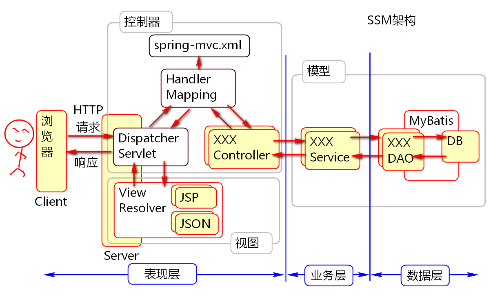
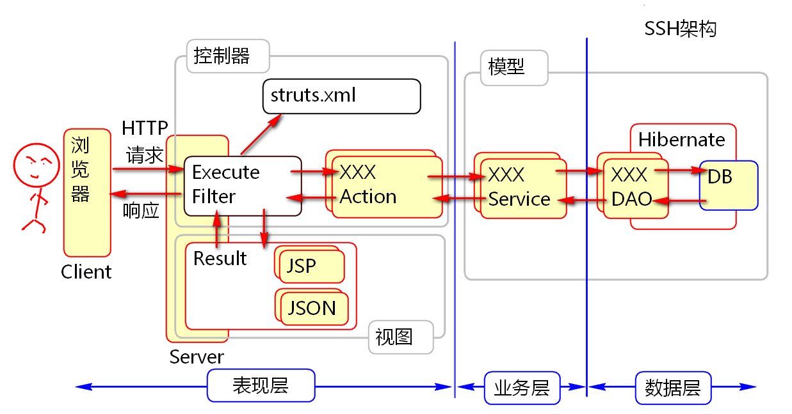
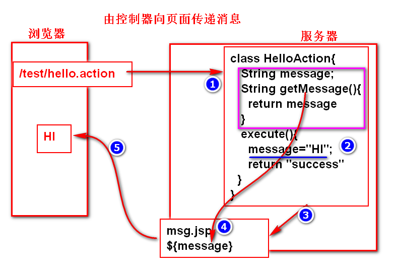
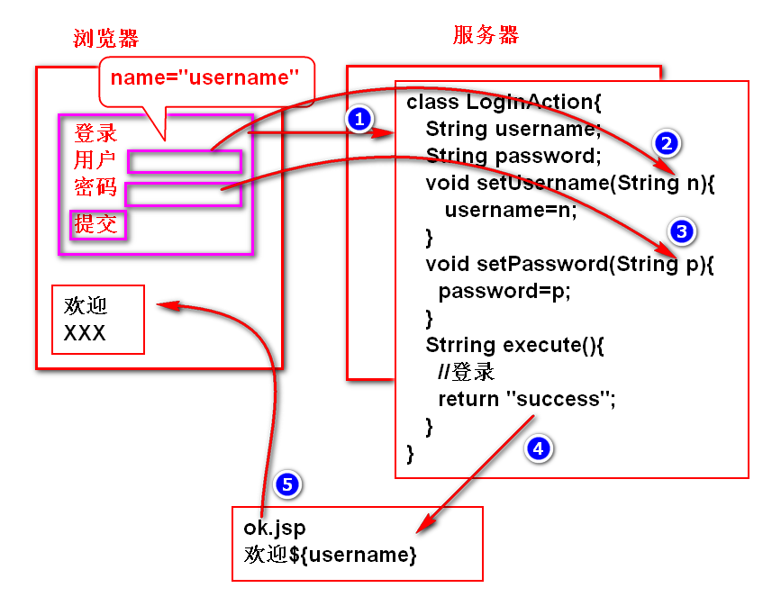
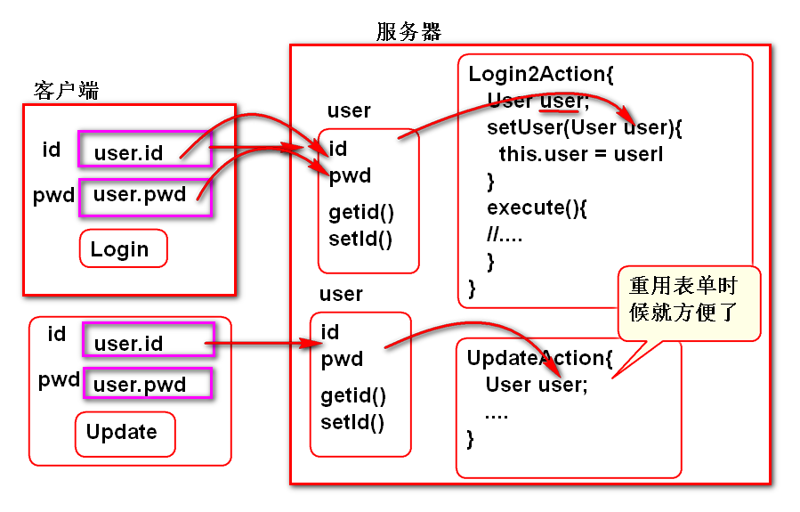

# Struts2

## Spring MVC

## Struts2 简介

1. 来自Apache基金会的软件： http://struts.apache.org
2. Struts2 与 Struts1 完全没有关系
3. Struts2 的前身是 WebWorks 
4. Spring MVC\Struts2\Struts1 都是 MVC 模式的Web框架
	- MVC是非常流行的 用户界面设计模式。
	- MVC是3层架构中的表现层。

## 配置Struts2

配置步骤：

1. 下载Struts2的jar包
	- 从struts.apache.org 下载
		1. 解压缩
		2. 将*.jar复制到 /WEB-INF/lib 文件夹
	- 使用maven下载
		- 使用Eclipse内嵌搜索，搜索到 struts2-core 的“坐标(xml)”，保存pom.xml
		- 使用 maven.tedu.cn/nexus (maven.aliyun.com/nextus) 在线搜索, 搜索到 struts2-core 的“坐标(xml)”，保存pom.xml
2. 配置主控制器
	- 控制器类
		- org.apache.struts2.dispatcher.ng.filter.StrutsPrepareAndExecuteFilter
		- 在struts-core-xxxx.jar 包中
	- 编辑文件 web.xml(部署描述文件)
		- filter
		- filter-mapping
3. 添加struts的配置文件
	- 位置：package中（classpath中）
	- 文件名：struts.xml, struts的filter会自动按照文件名struts.xml找到这个文件, 文件名不能错！！！

web.xml: 

	<?xml version="1.0" encoding="UTF-8"?>
	<web-app xmlns:xsi="http://www.w3.org/2001/XMLSchema-instance" 
		xmlns="http://java.sun.com/xml/ns/javaee"
		xsi:schemaLocation="http://java.sun.com/xml/ns/javaee http://java.sun.com/xml/ns/javaee/web-app_2_5.xsd" 
		version="2.5">
	  <!-- Struts2 MVC 配置 -->
	  <!-- filter 会自动找package中的struts.xml -->
	  <filter>
	  	<filter-name>mvc</filter-name>
	  	<filter-class>
	  	org.apache.struts2.dispatcher.ng.filter.StrutsPrepareAndExecuteFilter
	  	</filter-class>
	  </filter>
	  <filter-mapping>
	  	<filter-name>mvc</filter-name>
	  	<url-pattern>*.action</url-pattern>
	  </filter-mapping>

	</web-app>

空白 struts.xml

	<?xml version="1.0" encoding="UTF-8"?>
	<!DOCTYPE struts PUBLIC
		"-//Apache Software Foundation//DTD Struts Configuration 2.3//EN"
		"http://struts.apache.org/dtds/struts-2.3.dtd">
	<struts>
	
	</struts>

## Hello World！步骤

1. 修改配置文件struts.xml 添加web请求的处理路径
	- <package name="test" namespace="/test" extends="struts-default">
		- namespace="/test" 表示处理一级路径 /test
		- extends="struts-default" 继承现有struts的参数
	- <action name="hello" class="com.tedu.HelloAction">
		- name="hello"处理2级路径 /test/hello.action
		- class="com.tedu.HelloAction" 
			- 在处理url请求时候执行HelloAction 的 execute() 方法，
			- execute方法一定有String返回值，常见的值有 "success" "error"
	- <result name="success">/WEB-INF/msg.jsp</result>
		- 与action方法的返回值配合, 表示返回 “success”时候，转发到msg.jsp页面，msg.jsp作为用户看的视图。
2. 添加类 com.tedu.HelloAction
	- 包含 String execute()
	- 方法中 return "success";
3. 添加  /WEB-INF/msg.jsp

struts.xml 文件参考：
	
	<?xml version="1.0" encoding="UTF-8"?>
	<!-- struts.xml -->
	<!DOCTYPE struts PUBLIC
		"-//Apache Software Foundation//DTD Struts Configuration 2.3//EN"
		"http://struts.apache.org/dtds/struts-2.3.dtd">
	<struts>
		<!-- 用于配置请求路径与控制器的匹配关系 -->
		<!-- /test 请求被这个包进行处理 -->
		<package name="test" namespace="/test"
			extends="struts-default"> 
			<!-- 请求/test/hello.action时候
			执行HelloAction的execute()方法 -->
			<action name="hello"
				class="com.tedu.HelloAction">
				<!-- execute方法返回success 
				时候，转发到msg.jsp-->
				<result name="success">
					/WEB-INF/msg.jsp
				</result>
			</action>
		</package>
	</struts>

HelloAction.java :

		
	package com.tedu;
	
	public class HelloAction {
		/**
		 * 方法名必须是execute
		 */
		public String execute(){
			System.out.println("Hello World!"); 
			//返回值时候success
			return "success";
		}
	}

msg.jsp:

	<%@ page language="java" 
		contentType="text/html; charset=UTF-8"
	    pageEncoding="UTF-8" %>
	<!DOCTYPE html>
	<html>
		<head>
			<meta charset="utf-8">
			<title>Hello</title>
		</head>
		<body>
			<h1>Hello World!</h1>
		</body>
	</html>

## 由控制器向页面传递消息

1. 在控制器中添加属性，并且为属性添加get方法
2. 在控制器方法中向属性赋值
3. 在JSP页面上使用 EL 表达式读取属性值
	- EL表达式实际上执行属性的get方法，如果没有get方法就无法获取属性值。

案例：
	
HelloAction

	public class HelloAction {
		private String message;
		public String getMessage() {
			return message;
		}
		/**
		 * 方法名必须是execute
		 */
		public String execute(){
			message = "Hi";
			System.out.println("Hello World!"); 
			//返回值时候success
			return "success";
		}
	}

msg.jsp

	<%@ page language="java" 
		contentType="text/html; charset=UTF-8"
	    pageEncoding="UTF-8" %>
	<!DOCTYPE html>
	<html>
	<head>
	<meta charset="utf-8">
	<title>Hello</title>
	</head>
	<body>
		<h1>Hello World!</h1>
		<!-- 自动调用getMessage方法获取信息 -->
		<h2>${message}</h2>
	</body>
	</html>

## 从页面向控制器传递值

有两种方式可以从页面向控制器传输数据：

1. 基本属性传递方式
2. 域模型属性传递方式

### 1. 基本属性传递方式

1. 在控制器中声明与html表单项 name 属性一致的Bean属性。
2. 添加Bean属性的getxxx setxxx方法。
3. Struts会在接受请求时候，自动将表单属性值注入到 Bean 属性中

代码：

Login.jsp

	<%@ page language="java" 
		contentType="text/html; charset=UTF-8"
	    pageEncoding="UTF-8"%>
	<%@taglib prefix="c" 
		uri="http://java.sun.com/jsp/jstl/core"%>
	<!DOCTYPE html>
	<!-- /WEB-INF/login.jsp -->
	<html>
	<head>
	<meta charset="utf-8">
	<title>登录</title>
	</head>
	<body>
		<h1>登录</h1>
		<c:url var="url" 
			value="/user/login.action"/>
		<form action="${url}" method="post">
			

				<label>用户名:</label>
				<input type="text" 
					name="username"/>
			
		
			

				<label>密码</label>
				<input type="password"
				  name="password">
			

			

				<input type="submit" value="登录">		
			

		</form>
	</body>
	</html>

LoginAction.java

	public class LoginAction {
		private String username;
		private String password;
		//getxxx setxxx 称为：Bean 属性访问方法
		public String getPassword() {
			return password;
		}
		public void setPassword(String password) {
			this.password = password;
		}
		public String getUsername() {
			return username;
		}
		public void setUsername(String username) {
			this.username = username;
		}
	
		public String execute(){
			System.out.println(
				username + "," + password);
			//完整的登录逻辑...待续
			return "success";
		}
	}

ok.jsp
	
	<%@ page language="java" 
		contentType="text/html; charset=UTF-8"
	    pageEncoding="UTF-8"%>
	<!DOCTYPE html>
	<html>
	<head>
	<meta charset="UTF-8">
	<title>成功消息</title>
	</head>
	<body>
		<h1>欢迎 ${username}</h1>
	</body>
	</html>

struts.xml (片段)
	
	<package name="user"
		namespace="/user" 
		extends="struts-default">
		<!--显示登录页面/user/loginForm.action-->
		<action name="loginForm">
			<result>/WEB-INF/login.jsp</result>
		</action>
		<!-- 处理登录请求/user/login.action -->
		<action name="login"
			class="com.tedu.LoginAction">
			<result name="success">
				/WEB-INF/ok.jsp
			</result>
		</action>
	</package>	

### 2. 域模型属性传递方式 

利用域模型打包传递表单数据, 优点：
1. 可以便捷的处理表单输入项目很多
2. 特别是在表单被项目重用时候，显得更加方便。

原理：

步骤：
1. 创建域模型对象 User
	- 添加属性 id 和 pwd
	- 添加bean属性访问方法
2. 在控制器中添加User属性user和get set方法
3. 在表单中的输入项目name属性值为：user.id

代码：

User.java

	public class User implements Serializable{
		
		private String id;
		private String pwd;
		
		public String getId() {
			return id;
		}
		public void setId(String id) {
			this.id = id;
		}
		public String getPwd() {
			return pwd;
		}
		public void setPwd(String pwd) {
			this.pwd = pwd;
		}
		@Override
		public String toString() {
			return "User [id=" + id + ", pwd=" + pwd + "]";
		}
	}

Login2Action.java

	public class Login2Action {
		private User user;
		public void setUser(User user) {
			this.user = user;
		}
		public User getUser() {
			return user;
		}
		public String execute(){
			System.out.println(user); 
			//其他登录逻辑
			return "success";
		}
	}	

login2.jsp (片段)

	<h1>登录</h1>
	<c:url var="url" 
		value="/user/login2.action"/>
	<form action="${url}" method="post">
		

			<label>用户名:</label>
			<input type="text" name="user.id"/>
		
		
		

			<label>密码</label>
			<input type="password" name="user.pwd">
		

		

			<input type="submit" value="登录">		
		

	</form>

struts.xml(片段)

	<!-- 显示 login2.jsp -->
	<action name="login2Form">
		<result>/WEB-INF/login2.jsp</result>
	</action>
	<action name="login2"
		class="com.tedu.Login2Action">
		<result name="success">
			/WEB-INF/ok.jsp;
		</result>
	</action>

## 如何获取session对象

1. 通过工厂方法获取session对象
2. 利用注入获得session对象

### 1. 通过工厂方法获取session对象

Struts 提供了ActionContext对象，这个对象可以获取session，并且访问session。

案例：
	
	//获取 ActionContext 对象
	ActionContext context = ActionContext.getContext();
	//获取 session 对象	
	Map<String, Object> session=
			context.getSession();
	//将数据保存到session中	
	session.put("name", "Jerry");

> 提示：Struts2 为了降低耦合性，将HttpSession封装在Map中，调用Map的put方法就可以将数据保存到session中。

### 2. 利用注入获得session对象

使用ActionContext 对象获取Session对象，其缺点是将代码与ActionContext 对象耦合在一起，耦合度增加了。为减少耦合，Struts2提供了Session注入方式。

> 提示: 不仅仅Spring提供了注入功能，Struts2也利用注入方式工作。这里是Session就是注入得到，还可以注入Request对象。注入的好处是彻底实现了松耦合代码。

步骤：

1. 在Action类上实现SessionAware接口
	- class Login2Action implements SessionAware 
2. 在Action类中添加Session属性，和属性访问方法
	- private Map<String, Object> session;
	- public void setSession(Map<String, Object> session) {
	-	this.session = session;
	- }
3. 在execute方法中就可以利用 session 属性访问session了
	- session.put("loginUser", user);

案例：

Login2Action.java

	public class Login2Action 
		implements SessionAware, RequestAware{
		
		//注入session
		private Map<String, Object> session;
		public void setSession(Map<String, Object> session) {
			this.session = session;
		}
		//注入request
		private Map<String, Object> request;
		public void setRequest(
				Map<String, Object> req) {
			this.request = req;
		}
		
		private User user;
		public void setUser(User user) {
			this.user = user;
		}
		public User getUser() {
			return user;
		}
		public String execute(){
			/*
			 * 利用ActionContext 对象可以
			 * 获取当前环境中的所有信息
			 * 	 session
			 *   request
			 *   application 
			 *   ...
			 */
			//获取session对象
			//ActionContext context = 
			//		ActionContext.getContext();
			//HttpSession.setAttribute(k,v);
			//Map<String, Object> session=
			//		context.getSession();
			//session.put("name", "Jerry");
			
			System.out.println(user); 
			//登录逻辑
			//1. 获取表单信息
			//2. 调用业务层 验证表单信息
			//3. 登录成功
			//   1. 保存用户信息到session！！！
			//   2. 转发到登录成功页面
			//4. 登录失败
			//   1. 返回到登录页面
			if(user.getId().equals("robin")
				&& user.getPwd().equals("123")){
				//登录成功
				//将用户信息保存到session
				session.put("loginUser", user);
				//转发到ok.jsp
				return "success";	
			}
			//登录失败：转发返回login2.jsp
			//利用request将消息发送到页面
			request.put("message",
					"你想好了！！！");
			return "error";
		}
		
	}	

login2.jsp(局部)

	<h1>登录</h1>
	<c:url var="url" 
		value="/user/login2.action"/>
	<form action="${url}" method="post">
		<!-- 获取request中的message信息 -->
		<h2>${message}</h2>
		

			<label>用户名:</label>
			<input type="text" 
			name="user.id" value="${user.id}"/>
		
		
		

			<label>密码</label>
			<input type="password" name="user.pwd">
		

		

			<input type="submit" value="登录">		
		

	</form>

ok.jsp (局部)

	<!-- 获取session中的loginUser信息 -->
	<h2>${loginUser.id} 又登录了！</h2>

struts.xml(局部)

	<!-- 显示 login2.jsp -->
	<action name="login2Form">
		<result>/WEB-INF/login2.jsp</result>
	</action>
	<action name="login2"
		class="com.tedu.Login2Action">
		<result name="success">
			/WEB-INF/ok.jsp
		</result>
		<!-- 登录失败时候返回登录界面 -->
		<result name="error">
			/WEB-INF/login2.jsp	
		</result>
	</action>
	
-------------------------------------------

## 作业

0. 搭建Struts2环境，测试HelloWorld.
1. 利用 **基本属性传递方式** 实现登录过程
2. 利用 **域模型属性传递方式** 实现登录过程

